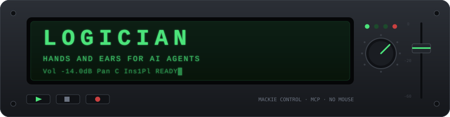

<div align="center">



# Logician

**Give your AI agent hands and ears in Logic Pro.**

[](#requirements)
[](https://github.com/BanneBanning/logician-mcp/actions/workflows/ci.yml)
[](Package.swift)
[](docs/AGENT-GUIDE.md)
[](LICENSE)

[What you can say](#what-you-can-say) · [Install](#install) · [Agent guide](docs/AGENT-GUIDE.md)

</div>

Logic Pro has no API, so every AI assistant could talk about your mix without being able to touch it. That always bugged me, so I built Logician. It gives Claude, Gemini, Cursor — any MCP client — hands and ears inside a real Logic project: it mixes, edits, composes and bounces, and it **hears the result**, because every render comes back as audio the agent actually listens to. Ask a multimodal agent to listen through your session and it returns with concrete moves it can execute itself the moment you say yes. Today's models already make a sharp assistant, and the ones coming will make a producer — this is the instrument I want waiting for them.

## What you can say

| You say | The agent does |
|---|---|
| *"Bounce bars 1–4 and tell me what you hear."* | Renders the master offline (no dialogs, session untouched), listens, and tells you what is actually in the audio. |
| *"More bass around 500 Hz, about 2 dB."* | Finds the bass track → finds the EQ (or adds one) → nudges the band → confirms the change against Logic's own readout. |
| *"The hats are too stiff — quantize them, but keep some feel."* | Sets the region's quantize with swing. The notes you played stay yours. |
| *"A/B that compressor setting on the master."* | Prints the mix twice — before and after — and hands you both versions, so the call is made with ears. |
| *"Fix the flubbed note in bar 3."* | Reads the region's MIDI, corrects the one note, leaves the take alone. |
| *"Lay down drums, bass and keys from bar 9."* | Writes the MIDI and imports the whole arrangement in one pass — onto your existing tracks if you name them — then verifies it note for note. |
| *"Ride the vocal up in the chorus."* | Records a volume automation pass over those bars and verifies the curve landed. |
| *"Give me stems of the chorus."* | Solo-bounces every track over the same bars — aligned, same length, ready to send. |
| *"Listen to the whole song. What would you change?"* | Bounces the mix and reads the whole project — levels, plugins, arrangement — then comes back with moves it can actually make. Say yes, and it makes them. |

Every change is verified against Logic's own readouts and rolled back on a mismatch — and nothing is ever saved without you asking.

## Install

> [!NOTE]
> **You need:** macOS 13+ · Logic Pro · Apple's command-line tools — if `swift --version` fails, run `xcode-select --install` first.

### 1 · Download & build

Paste into Terminal — the compile takes a minute or two:

```bash
git clone https://github.com/BanneBanning/logician-mcp.git
cd logician-mcp && swift build -c release
```

**You should see** `Build complete!` on the last line.

### 2 · Connect your AI

From inside that same folder — `$(pwd)` fills in the path so you never copy one by hand. One line for your client, then **restart the client**:

**Antigravity + Gemini** &nbsp;*(recommended — the agent can actually hear your mix)*

```bash
agy mcp add logician "$(pwd)/.build/release/logician"
```

**Claude Code**

```bash
claude mcp add logician -- "$(pwd)/.build/release/logician"
```

<details>
<summary><b>Other clients — Cursor · VS Code · LM Studio · Gemini CLI · anything MCP</b></summary>
<br>

One-click registration for these clients — **after** step 1 above:

[](https://cursor.com/install-mcp?name=logician&config=eyJjb21tYW5kIjoiL2Jpbi9zaCIsImFyZ3MiOlsiLWMiLCJleGVjIFwiJEhPTUUvbG9naWNpYW4tbWNwLy5idWlsZC9yZWxlYXNlL2xvZ2ljaWFuXCIiXX0%3D) &nbsp; [](https://vscode.dev/redirect/mcp/install?name=logician&config=%7B%22command%22%3A%22%2Fbin%2Fsh%22%2C%22args%22%3A%5B%22-c%22%2C%22exec%20%5C%22%24HOME%2Flogician-mcp%2F.build%2Frelease%2Flogician%5C%22%22%5D%7D) &nbsp; [](https://lmstudio.ai/install-mcp?name=logician&config=eyJjb21tYW5kIjoiL2Jpbi9zaCIsImFyZ3MiOlsiLWMiLCJleGVjIFwiJEhPTUUvbG9naWNpYW4tbWNwLy5idWlsZC9yZWxlYXNlL2xvZ2ljaWFuXCIiXX0%3D)

Straight talk about what these buttons do: they **only** register the server in the client — the one step they replace is the command in step 2. No button can compile Swift or click through Logic's Control Surfaces window, so steps 1, 3 and 4 are still yours. They also assume you cloned into your home folder (`~/logician-mcp` — where step 1 lands if you pasted it into a fresh Terminal). Cloned somewhere else? Use the JSON below instead.

**Gemini CLI** — installs as an extension (this repo ships a `gemini-extension.json`), then build inside it:

```bash
gemini extensions install https://github.com/BanneBanning/logician-mcp
cd ~/.gemini/extensions/logician && swift build -c release
```

**Any other MCP client** — point it at the binary. Print the exact path with `echo "$(pwd)/.build/release/logician"`, then:

```json
{ "mcpServers": { "logician": { "command": "/ABSOLUTE/PATH/TO/logician-mcp/.build/release/logician" } } }
```

</details>

### 3 · Let Logic see it *(one-time, ~5 clicks)*

First, ask your agent to **"Run logic_health"** once — that wakes Logician's helper and creates the MIDI port Logic is about to look for. Then, in Logic:

> [!IMPORTANT]
> **Logic Pro → Control Surfaces → Setup… → New ▾ → Install… → Mackie Control → Add**, then set **Input Port** *and* **Output Port** to **`Logic MCP MCU`**.

And grant **Accessibility** to your client when macOS asks (or: System Settings → Privacy & Security → Accessibility → switch on your client).

### 4 · Check it

Ask your agent one more time:

> **"Run logic_health"**

**You should see** `mcu_connected: true` and `accessibility_trusted: true` — it verifies every step above and names the exact fix for anything still missing. Then try the fun one:

> *"Bounce bars 1–4 and tell me what you hear."* 🎧

📖 **First time setting up an MCP server?** The [**step-by-step Installation Guide**](docs/INSTALL.md) walks every single click, with a troubleshooting table.

---

## How fast is it?

I stopwatch everything against a live reference project (25 mixer strips, 19 track headers). The rows I haven't clocked yet say **est.** until I have.

| Capability | Measured |
|---|---|
| Bounce any bar range of the master, zero dialogs, audio attached | ~7 s |
| Render one track to a file via Track Freeze, sliced to bars | ~6–8 s |
| A/B a parameter change on one track, metrics + both audio versions, auto-rollback — `method: "render"` | ~15 s |
| The same A/B via `method: "bounce"` (master output rather than a track freeze) | ~20 s |
| A/B on tracks freeze refuses (stack subtracks, shared channels) via `method: "solo_bounce"` | 157 s measured; **est.** ~50 s since the bounce-position fix |
| Set any plugin parameter, verified via LCD echo, incl. third-party | ~1.5–1.9 s warm (~3.8 s first call) |
| Compose a MIDI arrangement by import — multi-track, note-diff verified | ~8 s, +~6 s per track routed onto an existing track |
| Perform MIDI (notes, CC, pitch bend) through the track's instrument, render-verified | real time + ~10 s |
| Automation curve (volume), recorded and playhead-chase verified | ~20 s |
| Read the whole mixer in one call — every strip's dB, mute/solo/arm, pan (25 strips) | ~16–17 s |
| The same read as part of a `mix`-scope project snapshot (adds the track/strip census) | ~23 s |
| Structured snapshot of the whole project (transport, regions, markers, tempo/meter maps) | ~2 s |
| Reset to a fixture project — close without saving, reopen, verify (built for eval loops) | **est.** ~5 s |
| Duplicate the project to a safe sandbox copy | ~2 s |

## Requirements

- macOS 13+, Logic Pro (tested on 12.x, English UI — v1 assumption)
- Swift toolchain (to build from source)
- One-time: Accessibility permission for your MCP client, and a Mackie Control device in Logic pointing at the `Logic MCP MCU` ports (Logic Pro → Control Surfaces → Setup → New → Mackie Control — `logic_health` walks you through it)

## Tool overview (83 tools)

- **See the project** — tracks, regions, markers, windows; the whole mixer in one call (every strip incl. auxes, buses and outputs); what each track is (type, instrument, routing, groups); a region's MIDI events; existing automation curves; or the entire project as one structured snapshot
- **Diagnostics & lifecycle** — `logic_health` (a doctor that names the fix for anything broken); open/close/save/duplicate projects; verified reset to a fixture project
- **Transport** — play/stop, playhead, cycle range, metronome — verified via MCU LEDs and timecode
- **Mixing** — volume (dB-converged), pan, mute, solo, record-arm, sends, insert bypass, output/group routing; the master chain and buses address by name (`Stereo Out`, auxes)
- **Plugins & instruments** — add/remove, read/write **any** parameter of any plugin (third-party included), browse and select presets by name, load instruments
- **Regions** — select (multi too), move, copy, split (dialog-aware), nudge, rename, remove silence; region parameters: quantize, swing, transpose, velocity, loop, mute, gain, fades
- **Composition & tempo** — compose whole multi-track arrangements by MIDI import (seconds, note-for-note verified, straight onto your own tracks), or perform MIDI (notes/CC/pitch bend) through the track's real instrument in real time; edit single notes in place; tempo and meter maps are read, integrated into all bar math, and editable; the Smart Tempo mode is checked before recording so an Adapt-mode project is refused, never rewritten
- **Automation** — read existing curves; record new ones in any mode, playhead-chase verified
- **Audio out** — bounce (with format/depth/dither options), bounce-in-place, stem export, freeze renders sliced to bars, A/B evaluation carrying both audio versions; audio comes back inline **and** as fetchable MCP resource links, so a client that can't take it inline can still pull it on demand. A listen-first mode (`blind: true`) holds the numbers back until the agent has actually listened — descriptions come from ears, then the metrics
- **Key commands** — trigger any learned command; learn any of Logic's ~1400 by name, consent-recorded

## Under the hood

Logic Pro has no automation API. Every other Logic MCP drives the UI: blind keypresses, dialog clicking, coordinate mouse moves, window scraping. Logician instead speaks **Mackie Control** — Logic's documented, bidirectional control-surface protocol — over virtual MIDI ports, and reads Logic's own LCD/LED/fader echoes back as verification. Where the surface protocol ends it uses macOS Accessibility semantics and a dedicated MIDI port bound to Logic key commands.

That buys three things UI automation can't give you:

1. **Universal plugin control.** Third-party plugins with fully custom UIs (Trilian, Decapitator, …) expose nothing to Accessibility — but everything to the control-surface host automation layer. Logician reads and writes any parameter of any plugin.
2. **Hardware-level ground truth.** Every write is compare-and-set: read the current value, refuse on mismatch, converge to the target, read Logic's echo back, report exactly what happened. The agent cannot hallucinate a parameter value — the LCD echo is the value.
3. **Your mouse stays yours.** Nothing needs to be open, arranged or visible for the agent to work, because it talks to Logic the way a hardware mixing desk does. The few times it presses one of Logic's own shortcuts, your pointer ends up exactly where you left it, and every write reports which route it took. You can keep working while the agent mixes.

<details>
<summary><b>Architecture</b></summary>

```
MCP client (Claude, Gemini, Cursor, …)
        │ stdio / JSON-RPC (results carry audio content blocks)
logician  ──spawns──▶  logician --bridge (daemon)
   │        │                    │  virtual CoreMIDI ports (fixed IDs):
   │        │ unix socket        │   "Logic MCP MCU"      (Mackie Control ⇄ Logic)
   │        └────────────────────┤   "Logic MCP Commands" (key commands → Logic)
   │                             │   "Logic MCP MIDI In"  (performance MIDI → Logic)
   └─ macOS Accessibility (element-addressed reads, track selection,
      region editing, dialogs)
```

Safety model: read before write, abort on ambiguity, verify by readback, roll back on mismatch, never save without being asked, duplicate before destructive experiments.

</details>

## Known limitations & roadmap

- The biggest limitation is the models themselves: today's multimodal agents are not yet the mixing engineers you might wish for. Half the reason I built this was to find out exactly how good they really are — sharp assistant, not yet a producer. The tool is ready for the day that changes.
- English Logic UI is the fully supported one for now. The server detects Logic's language and says plainly what degrades on others (the control-surface side barely cares); locale tables are in progress — French is measured, more languages land as they're captured
- Tempo and meter maps are read from Logic's own lists and integrated into all bar math; tempo *curves* are approximated as steps (the Tempo List does not expose them) with the uncertainty quantified. MIDI *recording* takes real time — composing by import takes seconds.
- Track stacks cannot be freeze-rendered (Logic limitation — `solo_bounce` covers their subtracks)
- Recording automation needs a track header, so it cannot run on headerless strips — `Stereo Out`, auxes, buses. Setting the automation mode reads it off the track header's Accessibility label, and those strips have none. Their volume, pan, sends and plugin parameters are still writable; only recorded *curves* are out of reach.
- Roadmap: Homebrew — or an even simpler one-click installer for musicians who've never met a terminal — as soon as the repo is public; tempo curves; note-level MIDI beyond the Event List; localization

---

<div align="center">
<sub>Built by <a href="https://www.linkedin.com/in/alexander-banning-663788205/"><b>Alexander Banning</b></a> — say hi on LinkedIn · Released under the <a href="LICENSE">MIT license</a></sub>
</div>
